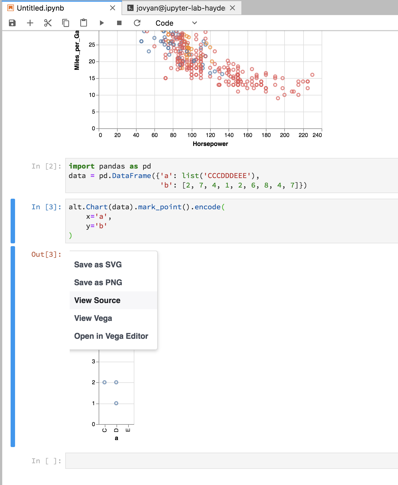
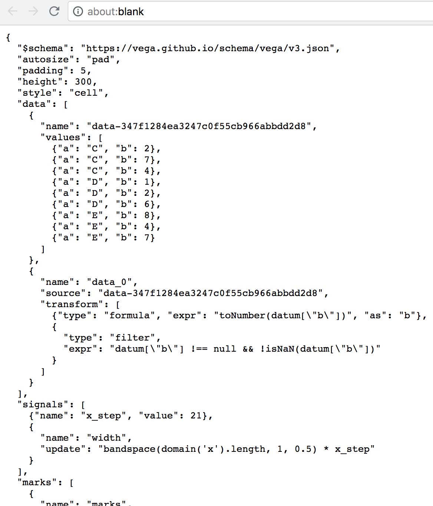

# DASH away day: Vega-lite / open data
29th August 2018, room 1.19, 10 South Colonnade

## Timings for the day
|  Timings | Area        | Description  |
| ------------- |-------------| -----|
| 10:00 - 10:15  | 1.19 | Arrival + introductions |
| 10:15 - 10:30 | 1.19 | Introduction to Vega-lite (Robin) |
| 10:30 - 10:45 | 1.19 | Introduction to Away day plans (Hayden) |
| 10:45 - 11:00  | 1.19 | Choose a dataset & form teams |
| 11:00 - 12:30 | Breakout | Split in to small groups and work on chosen project |
| 12.30 - 13.15 | Lunch | Lunch |
| 13.15 - 15.45  | Breakout | Split in to small groups and work on chosen project |
| 15:45 - 16:30 | 1.16 | Present back, summarise, discuss Vega vs alternatives, next steps |
| 16:30 | The Merchant | Drinks! |

## Aims for the day

We will be taking open datasets and learning how to use the vega-lite visualisation grammar to produce interactive charts and graphs, first in a stand alone manner before moving on to produce a stand alone HTML/Observable publication or dashboard.

This can be broken down into the following steps:
 
1. Learn how vega-lite works, produce some stand alone visualisations with example data and customise
2. Customise your visualisations using your open data
3. Produce a dashboard/publication framework using Observable/HTML and embed visualisations and text.

A few examples of what you can to aim for as an output:

* https://s3.amazonaws.com/testdeleterobin/www/index.html
* https://beta.observablehq.com/@robinl/draft-prototype-receipts-disposals-and-cases-outstanding-
* https://www.ethnicity-facts-figures.service.gov.uk/crime-justice-and-the-law/policing/confidence-in-the-local-police/latest
* https://data.justice.gov.uk/prisons

## Dataset options 

Below we have provided some example datasets which you 

#### Prisons data
https://www.gov.uk/government/statistics/safety-in-custody-quarterly-update-to-march-2018 

#### Treasury spending data
https://www.gov.uk/government/publications/hmt-spend-greater-than-25000-march-2018

#### Criminal Court data
https://www.gov.uk/government/collections/criminal-court-statistics 

#### Geographic Deprivation
https://www.gov.uk/government/statistics/english-indices-of-deprivation-2015

#### Geographic Crimes by Area
https://data.london.gov.uk/dataset/recorded_crime_summary 

(Shape files for the geographic regions are list below)

#### Any other datasets

If you have something in mind then please feel free to use any open dataset in addition to or instead of the above.

##### Shape files and geographic lookups (for the geographic datasets)
http://geoportal.statistics.gov.uk/datasets/lower-layer-super-output-areas-december-2011-super-generalised-clipped-boundaries-in-england-and-wales/data

If LSOA is too low level to produce a geographic plot then try mapping up to a higher output area, for example:

http://geoportal.statistics.gov.uk/datasets/lower-layer-super-output-area-2011-to-upper-tier-local-authorities-2017-lookup-in-england-and-wales/data

http://geoportal.statistics.gov.uk/datasets/upper-tier-local-authorities-december-2011-boundaries/data?selectedAttribute=st_area(shape)

## Guidance

The aim of today's away day is to give you a chance to try out Vega-lite and the different ways of producing and embedding vega-lite visualisations. As a helpful starter you may wish to follow the instructions below to get going (details for each step are under the headings below):

1. Copy the code behind one of the Vega-lite examples into the Vega-lite editor code. Make some changes to the vega-lite code to see whats possible until you produce a chart you're happy with.

2. Take data from a csv file and use it to produce a vega-lite visualisation. This can be done by linking to the csv file directly (if you plan on generating your webpage using python and jinja); or by using Altair in either python or R. Data munging code is available (https://github.com/RobinL/open_data_munge) to convert csv files directly into a JSON format.

3. Embed the visualisation into a webpage using either python+jinja, or Observable and create your own open data publication like the examples above.

### Testing Vega-lite
Vega-lite has a simple interactive editor with a number of different examples. As a first step you can try adapting the existing examples or building one of your own. Once you're happy with your chart you need to look at your dataset and what format you need it to be in to plug into vega.

https://vega.github.io/editor/#/

https://vega.github.io/vega-lite/examples/

https://vega.github.io/vega-lite/tutorials/getting_started.html 

If you are lucky enough to be using an API or an open data source in JSON format then you’ll be able input this data directly into your vega-lite visualisations as shown in the examples. However this is quite rare and if not you'll need to process the published csv files into something resembling a JSON format. Luckily there are a number of different ways you can do this depending on what language you're most comfortable with.

### Altair & Processing open data

#### Python

If you're comfortable using python there is a module called Altair which acts as a wrapper for vega-lite. It allows you to specify charts at a much higher level and use a pandas dataframe as your data input. An extremely helpful feature of Altair is that any charts you produce will have the option to show the source code created by Altair - this includes both the JSON format data and also the vega-lite code.

This can be run locally using jupyter lab or through the analytical platform.

You'll first need to open up a terminal and input: `pip install -U altair vega_datasets`

This will install altair and the example vega datasets

https://altair-viz.github.io/getting_started/starting.html

You can then follow the examples above to produce some basic charts. As seen below you can use these charts to produce both the vega-lite foundation for further editting and also the data format you'll need for adding the data to an observable notebook. As a next step try grabbing the source code and getting it to work in the vega-lite interactive visualiser.

#### R

If you'd prefer to use R there is also an R package called altair (notice the lower case A). The R package altair makes use of reticulate to run python code through R and effectively provides the same functionality as the Python Altair package, even if it is a little less user friendly.

Details on how to install and run altair in R can be found at the link:
https://github.com/vegawidget/altair

ISSUE - I CANT GET ONTO RSTUDIO AT THE MOMENT (PLATFORM ISSUES, SO WILL HAVE TO ADD ANOTHER TIME - AKA TUESDAY)

#### Robinl - Open-data-munging

JAMIE TO ADD DETAILS

https://github.com/RobinL/open_data_munge 

### Authoring reproducable documents with Vega

#### Observable Notebooks

JAMIE TO ADD DETAILS

Observable ????? - need specific JSON files https://beta.observablehq.com/@robinl/draft-prototype-receipts-disposals-and-cases-outstanding- 

#### Authoring HTML with Jinja

JAMIE TO ADD DETAILS

#### R-Shiny with Vega

